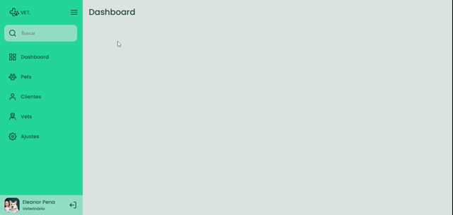

# Sidebar
Neste desafio foi criado um sidebar. Quando o usuário clicar no ícone do menu o estado da sidebar muda entre "aberto", mostrando ícones e texto e "fechado", mostrando apenas os ícones. Utilizando HTML, CSS e Javascript.

[🔗 Clique aqui para acessar](https://gabrielli-lima.github.io/Sidebar/)

## 🛠️ Tecnologias
- HTML
- CSS
- Javascript

